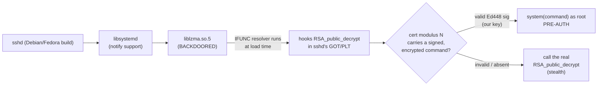
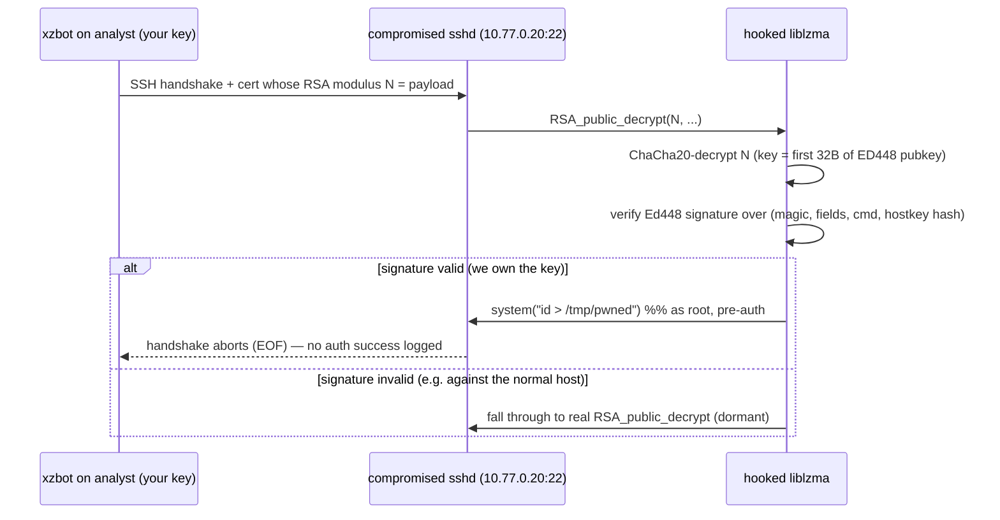

# Lab 2 walkthrough — Detonating the backdoor (safely)

This mirrors Lab 2 of the blog post, on an **isolated three-VM Multipass network**.
You operate from an `analyst` jumpbox and SSH to two hosts — a `compromised` one whose
system `sshd` is genuinely backdoored, and a `normal` one — comparing their latency and
wire traffic, then triggering the backdoor with **your own** Ed448 key. No Docker.

> [!CAUTION]
> The `compromised` VM runs the real xz backdoor in its system `sshd`. Every VM is
> taken **offline** (default route dropped) and all traffic stays on an isolated
> bridge (`xzbr0`) with no internet; only **your own** Ed448 key can trigger it. If
> the compromised host can reach the internet, setup **aborts**. Read
> [SECURITY.md](../SECURITY.md) first.

## 1. Set it up, then drive from the analyst

```bash
make lab2                       # build xzbr0 + analyst/compromised/normal, arm it
multipass shell analyst         # the control plane → your jumpbox
  ~/demo/demo-latency.sh        # SSH timing: normal vs compromised
  ~/demo/demo-capture.sh        # pcap the handshakes + the trigger
  ~/demo/demo-trigger.sh        # fire the backdoor (root RCE on compromised)
make clean                      # purge the 3 VMs, wipe keys/pcaps
```

## 2. The runtime hook chain

Why is `sshd` — which doesn't use `liblzma` directly — affected at all?



On Debian and Fedora, `sshd` links `libsystemd`, which pulls in `liblzma`. The
backdoor's glibc **IFUNC** resolver runs at load and redirects `RSA_public_decrypt`
to attacker code — reachable **before authentication**.

## 3. The trigger sequence



> **Why the vulnerable sshd needs specific settings.** The backdoor is only
> reachable through the legacy `ssh-rsa` certificate path that calls
> `RSA_public_decrypt`, and it binds its trigger signature to the server's **RSA**
> host key. Modern OpenSSH (9.x) disables `ssh-rsa`/`ssh-rsa` CA signatures by
> default and prefers ECDSA/ed25519 host keys — so a stock 9.x sshd rejects the
> certificate *before* the hooked function runs and the backdoor stays dormant.
> Lab 2's image therefore re-enables `ssh-rsa` + `CASignatureAlgorithms=ssh-rsa`
> and forces an **RSA-only host key**. This is a property of reproducing it on a
> current distro, not of the original 2024 attack (where RSA host keys and the
> legacy path were the norm).

## 4. Step-by-step (what `setup.sh` orchestrates)

1. **Isolated bridge.** Ensures `xzbr0` (`10.77.0.1/24`, no NAT) exists.
2. **Three VMs.** Launches `analyst` (.10), `compromised` (.20), `normal` (.30), each
   with a second NIC on `xzbr0` configured to a static IP via netplan.
3. **analyst (ONLINE).** Installs Go/git/tcpdump, clones **xzbot** at pinned commit
   `8ae5b706…`, builds the trigger client + the `keygen` helper, generates a **fresh
   random seed → Ed448 public key**, and an SSH keypair for the other hosts.
4. **compromised (ONLINE, arms it).** Downloads `liblzma5 5.6.1-1` from
   snapshot.debian.org, **verifies it against IOC `605861f8…`** (abort on mismatch),
   patches in **analyst's** public key with `patch_key.py`, installs it as the system
   `liblzma.so.5`, configures the native `sshd` for the backdoor-reachable cert path
   (legacy `ssh-rsa` + RSA-only host key), and restarts `sshd`.
5. **normal.** Authorizes the analyst's SSH key on an otherwise stock `sshd`.
6. **Isolate.** Drops the default route on every VM (kills internet, keeps the
   Multipass mgmt link + the isolated bridge), then runs the **isolation guard** —
   `common/lib.sh::guest_assert_offline_cmd` — on `compromised`; if it can still reach
   `1.1.1.1` the run **aborts**.

## 5. Reading the result (from the analyst)

- **Latency (`demo-latency.sh`):** averaged SSH connect time to `normal` vs
  `compromised`. The backdoor does extra work in every forked `sshd`, so the
  compromised host is measurably slower — the same signal that first exposed it.
- **Wire (`demo-capture.sh`):** three `tcpdump` captures on the isolated NIC. All are
  encrypted post-KEX, but the **trigger** carries a giant RSA-modulus certificate, so
  its byte count dwarfs a normal login.
- **RCE (`demo-trigger.sh`):** on `compromised`, `/tmp/pwned` gains `uid=0(root)…`
  with **no successful-auth log** — pre-auth root RCE. The *same* trigger against
  `normal` does nothing (its `liblzma` is stock).

## 6. Why you can't do this to a *real* server

You triggered the backdoor only because **you generated the key the server was
told to trust**. The original attacker's Ed448 private key is **unobtainable**
(~224-bit security) — see [03-how-it-works.md](03-how-it-works.md). With the wrong
key the backdoor stays dormant and indistinguishable from a normal `sshd`.

---

Back to: [01-inspection.md](01-inspection.md) · Mechanism deep-dive:
[03-how-it-works.md](03-how-it-works.md)
