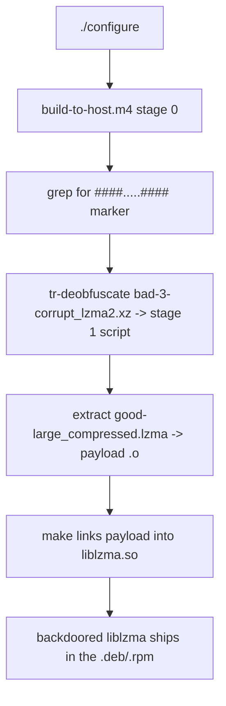
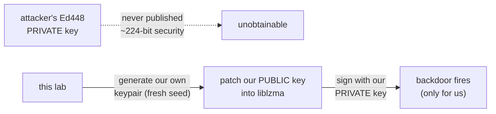

# How it works — mechanism, trigger, and "you can't crack the key"

A self-contained explanation of CVE-2024-3094: how the payload got in, how it armed
itself at build time, how it hooked `sshd` at runtime, and why the trigger is a
signed pre-auth RCE rather than a magic login or C2.

## 1. Three stages, three hiding places

| Stage | Lives in | Job |
|-------|----------|-----|
| 0 | `m4/build-to-host.m4` (tarball only) | At `./configure`, find the magic-marked file, de-obfuscate it, run the next stage. |
| 1 | `tests/files/bad-3-corrupt_lzma2.xz` | A *valid* `.xz` that decompresses to a script extracting stage 2. |
| 2 | `tests/files/good-large_compressed.lzma` | The real payload object, patched into `liblzma` during `make`. |

The activation was **conditional**: x86-64 Linux, glibc, GCC, built under a deb/rpm
packaging flow. On anything else it stayed inert — which is part of why it survived
review and CI.



## 2. Runtime: the IFUNC hook

glibc **IFUNC** ("indirect function") lets a library pick a function implementation
at load time via a resolver. The backdoor abused this: its resolver ran during
dynamic loading and rewrote `sshd`'s indirect call for **`RSA_public_decrypt`** to
point at attacker code.

`sshd` is reachable because, on Debian/Fedora, it links `libsystemd` (for readiness
notification), and `libsystemd` links `liblzma`. So loading `sshd` loads the
backdoored `liblzma`, which arms the hook **before authentication**.

## 3. The trigger: a command inside the RSA modulus

The attacker connects with an SSH certificate whose **CA signing key's RSA modulus
`N`** is not a real modulus — it's a structured payload:

```
+----------------+----------------+--------------------------------+
|   a (32 bit)   |   b (32 bit)   |           c (64 bit)           |
+----------------+----------------+--------------------------------+
|                  ciphertext (240 bytes)                          |
+------------------------------------------------------------------+
```

- A **request type** is derived as `a*b + c`. Type 2 = "execute the command with
  `system()`."
- The ciphertext is **ChaCha20-encrypted** (symmetric key = first 32 bytes of the
  attacker's Ed448 public key) and contains an **Ed448 signature** plus the command.
- The signature (RFC-8032 Ed448) covers the magic value, the header fields, the
  command bytes, and **the first 32 bytes of the SHA-256 of the server's host key**
  (binding the payload to a specific server).

Validation flow inside the hooked function:

1. Decrypt `N` with the embedded ChaCha20 key.
2. Verify the Ed448 signature with the embedded **public** key.
3. **Valid →** `system(command)` as root, pre-auth, then the handshake aborts.
   **Invalid →** call the real `RSA_public_decrypt` and behave normally (stealth).

This is why it is **not** C2 (no outbound channel) and **not** an auth bypass you can
log into — it's a one-shot, signed, pre-auth command execution.

## 4. Why you cannot crack the key

The command must carry a valid **Ed448** signature verifiable by the **public** key
baked into `liblzma`. Producing such a signature requires the matching **private**
key. Ed448 offers roughly **224-bit** security; brute-forcing or solving the discrete
log is far beyond any feasible computation. The attacker never published the private
key, and it cannot be derived from the public key in the binary.

So a defender who *has* a backdoored server still **cannot** trigger it — unless they
do what this lab does: **replace** the trusted public key with one they generated
themselves (xzbot's key patch), and sign with the matching private key. That proves
the mechanism without ever needing the attacker's secret.



## 5. Discovery

Andres Freund noticed `sshd` using ~500 ms of extra CPU per login and Valgrind errors,
traced it to `liblzma`, and disclosed it to the `oss-security` list on **29 March
2024**. The backdoor was caught in unstable/testing channels **before** it reached
stable distros — a near miss measured in weeks.

## References

- Andres Freund's disclosure — <https://www.openwall.com/lists/oss-security/2024/03/29/4>
- amlweems/xzbot — <https://github.com/amlweems/xzbot>
- rya.nc, "putting a payload in a valid RSA N" — <https://rya.nc/xz-valid-n.html>
- lockness-Ko/xz-vulnerable-honeypot — <https://github.com/lockness-Ko/xz-vulnerable-honeypot>
- Sam James' FAQ — <https://gist.github.com/thesamesam/223949d5a074ebc3dce9ee78baad9e27>
- CISA alert — <https://www.cisa.gov/news-events/alerts/2024/03/29/reported-supply-chain-compromise-affecting-xz-utils-data-compression-library-cve-2024-3094>
