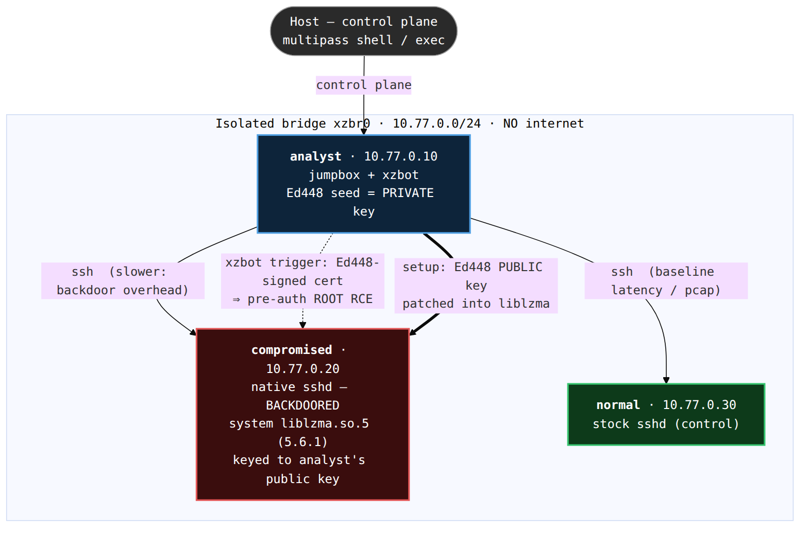
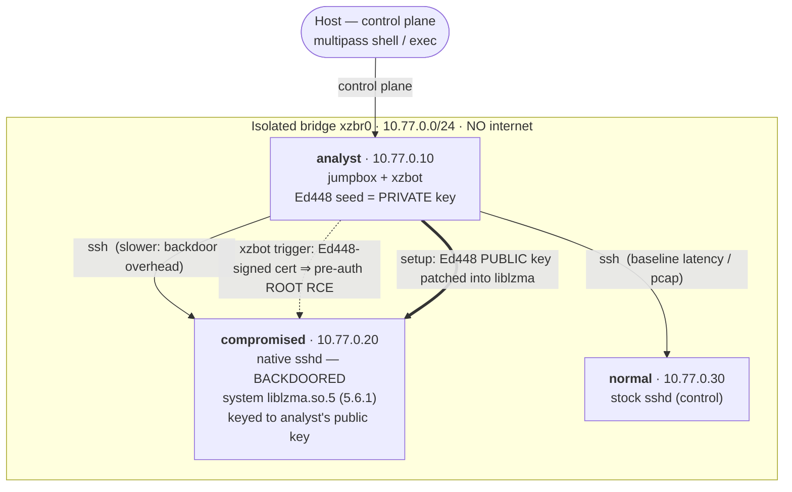

# Lab 2 — Detonation on an isolated three-VM network (no Docker)

**Goal:** stand up a small **isolated Multipass network** with three machines, then
— from an *analyst* jumpbox — SSH to a **compromised** host (backdoored `sshd`) and a
**normal** host, comparing the latency and wire traffic, and finally **triggering** the
backdoor with the analyst's own Ed448 key.



<!-- Diagram source: architecture.mmd. Regenerate the PNG with: bash render-diagram.sh -->

<details><summary>Mermaid source (renders on GitHub)</summary>



</details>

> [!CAUTION]
> The **compromised** VM runs the real xz backdoor in its system `sshd`. The lab
> takes every VM **offline** (drops the default route) before you drive it, keeps
> all traffic on an **isolated bridge with no internet**, and uses only **your own**
> Ed448 key. Never run this outside the isolated VMs. See [SECURITY.md](../SECURITY.md).

## Set it up

```bash
make lab2          # creates xzbr0 (if needed), launches 3 VMs, provisions, arms
# or directly:
bash lab2-detonate/setup.sh
```

What `setup.sh` does (online phase, then isolates):
1. Ensures the isolated bridge `xzbr0` (`10.77.0.1/24`, no NAT).
2. Launches `analyst`, `compromised`, `normal`, each with a NIC on `xzbr0` + static IP.
3. **analyst:** builds [xzbot](https://github.com/amlweems/xzbot) (pinned) + the Ed448
   keygen, generates a **fresh seed → public key**, and an SSH key for the other hosts.
4. **compromised:** downloads `liblzma5 5.6.1-1`, **IOC-verifies** it, patches in
   **analyst's** public key, installs it as the system `liblzma.so.5`, configures the
   native `sshd` for the backdoor-reachable cert path, restarts `sshd`.
5. **normal:** authorizes the analyst's SSH key on an otherwise stock `sshd`.
6. Drops the default route on every VM and **asserts the compromised host is offline**.

## Drive the demo (from the analyst)

```bash
multipass shell analyst
```

Then, in `~/demo/`:

| Helper | Shows |
|--------|-------|
| `./demo-latency.sh` | SSH connect time to `normal` vs `compromised` — the backdoor's per-connection overhead (the slowdown that first gave it away). |
| `./demo-capture.sh` | `tcpdump` of three scenarios on the isolated NIC: a login to `normal`, a login to `compromised`, and the **trigger** (note its giant RSA-modulus cert). |
| `./demo-trigger.sh` | Fire the backdoor on `compromised` (→ **root RCE**, `/tmp/pwned`), then the same trigger on `normal` (→ nothing). |

You can also just SSH around by hand: `ssh root@10.77.0.20` (compromised) and
`ssh root@10.77.0.30` (normal) both work with the analyst's key.

## Why only the analyst can trigger it

The backdoor validates an **Ed448 signature** with the public key baked into
`liblzma`. `setup.sh` patches in a key derived from a **fresh random seed** generated
on the analyst (`keys/seed.txt`, gitignored); the matching private key never leaves the
analyst. The real attacker's key is cryptographically unobtainable — see
[../docs/03-how-it-works.md](../docs/03-how-it-works.md). On `normal`, the same trigger
does nothing because its `liblzma` is the stock, unmodified library.

## Reproduction note (modern OpenSSH)

`compromised` re-enables the legacy `ssh-rsa` / `CASignatureAlgorithms=ssh-rsa` and
forces an **RSA-only host key**. OpenSSH ≥ 8.7 disables `ssh-rsa` and prefers
ECDSA/ed25519 host keys, which would make the cert get rejected *before* the hooked
`RSA_public_decrypt` runs. This is a property of reproducing it on a current distro,
not of the 2024 attack. (Details in [../docs/02-detonation.md](../docs/02-detonation.md).)

## Tear down

```bash
make clean                                  # purge the 3 VMs + wipe keys/pcaps
bash lab2-detonate/teardown.sh --remove-bridge   # also delete xzbr0
```

## Files

| Path | Role |
|------|------|
| `setup.sh` / `teardown.sh` | host orchestration |
| `config.sh` | network + VM + IOC settings |
| `provision/provision-*.sh` | per-VM guest provisioning |
| `analyst/demo-*.sh` | the manual demo helpers (installed to `~/demo`) |
| `keygen/keygen.go`, `patch_key.py` | Ed448 key derivation + the liblzma key-patch |

## Credits

Trigger client + liblzma key-patch technique from
**[amlweems/xzbot](https://github.com/amlweems/xzbot)** (MIT). `patch_key.py` is a
credited, dependency-free derivative of xzbot's `patch.py`.
